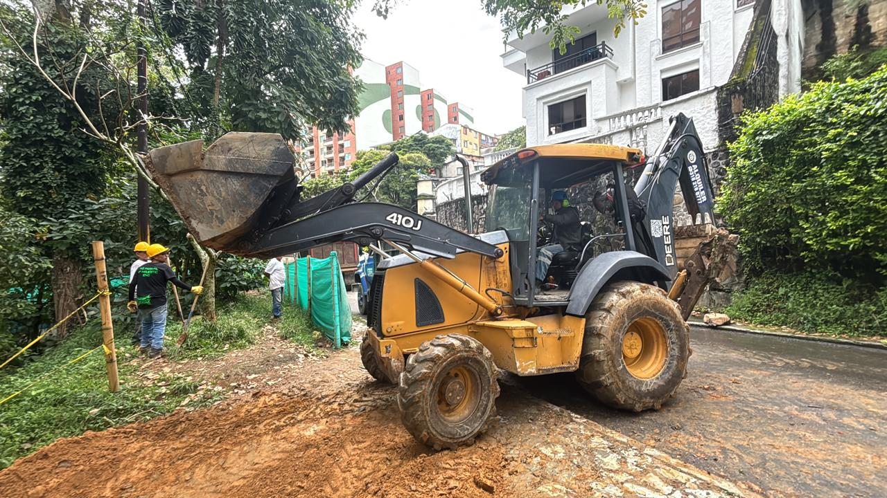
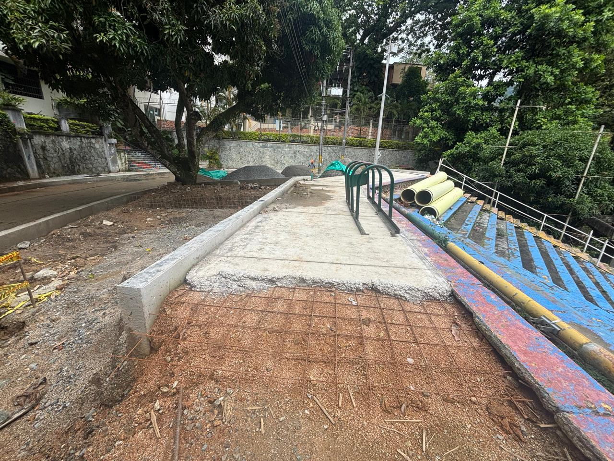

# Instrucciones para Agregar Videos a los Proyectos

## Problema Arreglado ✅
- ✅ Librería Swiper agregada a `proyectos.html`
- ✅ Error de inicialización de `todosLosProyectos` corregido
- ✅ Carrusel se desplaza automático cada 4 segundos
- ✅ Soporte para videos agregado

## Cómo Agregar Videos a los Carruseles

### Opción 1: Reemplazar una imagen con un video
En lugar de usar ``, usa `<video>`:

```html
<div class="carousel-item">
    <video class="carousel-media" controls muted>
        <source src="ruta/del/video.mp4" type="video/mp4">
        Tu navegador no soporta videos.
    </video>
</div>
```

### Opción 2: Agregar un video junto con imágenes
Simplemente inserta un `<div class="carousel-item">` con un `<video>` entre tus ``:

```html
<div class="carousel-item active">
    
</div>
<div class="carousel-item">
    <video class="carousel-media" controls muted>
        <source src="templates/video1.mp4" type="video/mp4">
    </video>
</div>
<div class="carousel-item">
    
</div>
```

### Opciones de Video Recomendadas:
- **`controls`** - Muestra los controles de reproducción (play, pausa, volumen)
- **`muted`** - Inicia sin sonido (necesario para autoplay en navegadores modernos)
- **`autoplay`** - El video se reproduce automáticamente
- **`loop`** - El video se repite indefinidamente
- **`poster="imagen.jpg"`** - Imagen que se muestra antes de reproducir

### Ejemplo Completo:
```html
<div class="carousel-item">
    <video class="carousel-media" controls muted loop poster="templates/3.1.jpeg">
        <source src="templates/video-proyecto.mp4" type="video/mp4">
        <source src="templates/video-proyecto.webm" type="video/webm">
        Tu navegador no soporta HTML5 video.
    </video>
</div>
```

## Características del Carrusel Actualizado:
1. ✅ Auto-desplazamiento cada 4 segundos
2. ✅ Botones de navegación (❮ y ❯)
3. ✅ Puntos indicadores
4. ✅ Pausa automática al pasar el mouse
5. ✅ Soporte para imágenes y videos
6. ✅ Los videos se pausan automáticamente cuando cambias de slide

## Modal de Proyectos:
El botón "Ver Todos los Proyectos" ahora funciona correctamente y muestra los 7 proyectos.

## Formatos de Video Recomendados:
- MP4 (.mp4) - Compatible con todos los navegadores
- WebM (.webm) - Tamaño más pequeño
- OGV (.ogv) - Alternativa abierta

## Nota Importante:
Los navegadores modernos requieren `muted` para que los videos se reproduzcan automáticamente. Si necesitas sonido, el usuario deberá hacer clic en el video para reproducirlo.
